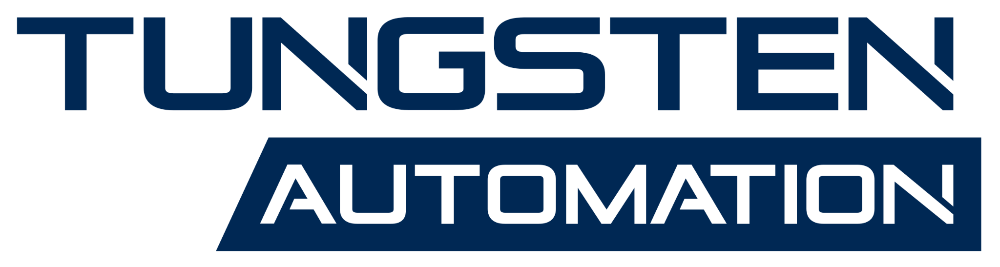
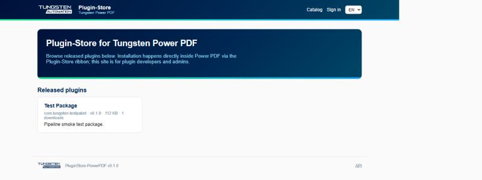

<div align="center">

<picture>
  <source media="(prefers-color-scheme: dark)" srcset="docs/img/tungsten-logo-white.svg">
  
</picture>

# Add-on Store for Tungsten Power PDF

**A private plugin store for Tungsten Power PDF.**
Publish `.ppak` plugin packages through a reviewed pipeline; end users browse
and install them with one click from an *Add-on Store* ribbon inside Power PDF.

[](https://portal.azure.com/#create/Microsoft.Template/uri/https%3A%2F%2Fraw.githubusercontent.com%2Fmnimtz%2Fpluginstore-powerpdf%2Fmain%2Finfra%2Fazuredeploy.json)




</div>

---

## Why

The Add-on Store consolidates Power PDF extensions in one place. Anyone who
builds a plugin with the Plugin SDK can offer it here centrally: it passes
automatic quality checks and a review, and users find, install and update it
directly inside Power PDF.

## How it works

```
 Developer (+ Claude, via API token)         Admin                 End user
        │                                      │                       │
        │ POST /api/packages/validate          │ review queue          │ Add-on Store ribbon
        │ POST /api/packages                   │ approve / reject      │ browse · install · update
        ▼                                      ▼                       ▼
  ┌──────────────────────────────────────────────────────────────────────────┐
  │   Add-on Store server · Azure Web App · SQLite + packages on /data      │
  │                                                                          │
  │   submitted ──(automatic checks)──▶ BETA channel ──(approval)──▶ LIVE    │
  └──────────────────────────────────────────────────────────────────────────┘
```

| | |
|---|---|
| 🏪 **End users never see this server** | The catalog is read anonymously by the Add-on Store ribbon add-on. Accounts exist only for plugin publishers and admins; registration is an access *request* that an admin approves. |
| 🔍 **Every upload is validated** | Manifest schema, SemVer monotonicity, x64 + ARM64 PE checks, debug-runtime detection, import-table scan, SHA-256 verification, ribbon governance, reserved names, layout and localization pitfalls. Every finding carries a stable `code` and a concrete `hint`. |
| 🗄️ **Source code escrow** | After every upload the agent also sends the source code of that version. It is checked (credentials, GPL/AGPL, build output), stored next to the version, visible to admins only and part of every backup; by default a version cannot be approved without it. |
| 🏷️ **Growing categories** | Every upload names a category. If none fits, the upload may propose a new high-level one (16 languages); the server rejects names that are too close to an existing category, too specific or beyond the limit, and creates it on submission. Admins merge or delete categories. |
| ✏️ **Editable catalog entry** | Owners and admins correct name, description (16 languages), author and contact on the server or via `PATCH /api/packages/{id}`, without a new version; the Power PDF client shows the change immediately. |
| 🧪 **Beta channel** | Versions that pass all automatic checks become instantly installable for users who enabled the beta option in Power PDF, while an admin reviews them for the live store. |
| 🤖 **Agent-friendly API** | `GET /api/agent-guide` teaches any AI assistant the full workflow with zero prior knowledge. Personal tokens let Claude validate, fix and submit packages in a loop until the report is green. |
| 📜 **Audit trail** | Registrations, approvals, tokens, submissions (version + changelog are mandatory), reviews and downloads are recorded and searchable. |
| 💾 **Backup and restore** | One click downloads a full backup (database, packages, avatars, developer kit); restore checks the archive, refuses to lock out the acting admin and keeps an automatic safety backup of the previous state. |
| ✉️ **Notifications** | Email via Resend with a test button (free recipient); admins choose which events send mail: access requests, submissions, client releases, and for authors upload receipts, approval or rejection, withdrawn or restored versions and catalog changes by an admin. Authors can opt out in their profile. Every sent or failed mail is in the audit log. |
| 🗂️ **Plug-in management** | One compact overview (admins: all plug-ins, authors: their own) with search and filters (awaiting approval, live, not in the store); a details page per plug-in to approve, reject, withdraw or restore versions, take a plug-in out of the store and edit its catalog entry. |
| 📱 **Phone-ready** | Menu button and card layout on small screens; the whole portal works on a smartphone. |
| 🛡️ **Licenses, legal and privacy** | Every upload carries a mandatory, truthful compliance statement (`thirdParty` components with SPDX licenses, `complianceAudit` with the external services a plugin contacts). The server verifies independently: copyleft and known-library signatures in binaries, credentials and key files, hosts compiled into the code, third-party brand names. Only MIT/BSD/Apache-2.0 code passes without review; GPL/AGPL/LGPL fails. |
| ⚖️ **Disclaimer** | Landing page, a dedicated disclaimer page and the Power PDF client state that plugins come from independent authors, without warranty or official support, and that Tungsten Automation accepts no liability. |
| 🌍 **16 European languages** | Auto-detected from the browser (including `no`/`nn` for Norwegian), manually switchable, with localized catalog texts straight from the package manifests. |

## Deploy in one click

Press **Deploy to Azure** above and fill in one required parameter:

| Parameter | Default | Meaning |
|---|---|---|
| `siteName` | *(required)* | Globally unique name → `https://<siteName>.azurewebsites.net` |
| `sku` | `B1` | ~13 USD/month, always-on. `F1` is free but sleeps when idle. |
| `containerImage` | `ghcr.io/mnimtz/pluginstore-powerpdf:latest` | Pin a version tag for reproducible deployments |
| `tz` | `Europe/Berlin` | IANA timezone |

The template provisions a Linux App Service running the GHCR container plus a
storage account with a file share mounted at `/data` (SQLite database, plugin
packages, developer kit). No connection strings, no secrets to manage.

**First run:** open the site, the setup wizard creates the first administrator
account. Colleagues use *Request access* on the login page; admins approve on
the Users page.

**Email notifications** via [Resend](https://resend.com): enter the API key
and sender on the admin **Settings** page (or as app settings
`Email__ResendApiKey` / `Email__From`), use **Send test email** to check the
setup, and choose which events send mail. Without a key the app runs
normally; skipped mails are recorded in the audit log.

**Backup and restore:** admin **Settings → Backup and restore**. Store backup
files like passwords: they contain password hashes and settings.

## The Power PDF client

The `client/` folder holds the **Add-on Store ribbon add-on** (C++/MFC `.zxt`,
built with the Power PDF Plugin SDK):

- Adds an *Add-on Store* group to the shared **Enhanced Features** ribbon tab.
- **Modern store window** (client 0.4+): cards with icon, status and one-click
  action, search, category chips and a detail panel, rendered by Microsoft
  WebView2 from a page compiled into the plug-in (`client/ui/store.html`). Data
  is inserted as text only; the page cannot navigate or load anything external.
  Without the WebView2 runtime, or with `ClassicUI = 1` (HKCU or the HKLM
  policy key), the classic list dialog opens instead.
- Lists the catalog with localized names, changelogs, installed versions and
  update status; installs with SHA-256 verification and a single UAC prompt.
- Drops each package's `manifest.json` next to the plugin, so updates are
  detected for every plugin, including MSI-deployed ones.
- Options page under *File → Options → Add-on Store*: server URL (defaults to
  your instance, enforceable via HKLM policy) and the beta-channel switch.
- **One firewall rule is enough:** catalog, downloads and self-updates use
  HTTPS (port 443) to the configured store host only, through the system proxy.
  The client refuses plain HTTP (except localhost for development) and any
  other host, whatever the catalog says.
- **"Install in Power PDF" buttons** on the catalog website: the MSI registers
  the `addonstore://` URL scheme with a small helper (`AddonStoreLink.exe`) that
  passes a validated package id to the client; Power PDF opens the store dialog
  with that add-on selected and asks before installing. A website can only open
  the dialog, never install anything by itself.
- The first browser download of the unsigned MSI may trigger Windows SmartScreen
  ("More info" → "Run anyway"); the landing page explains this. Updates and
  plug-ins installed from the client are not affected.
- A fresh MSI installation (not an update) clears leftovers of removed plugins
  from the shared *Enhanced Features* tab once per user; installed plugins add
  their groups again on their next start.

End users install it with the MSI from the store's landing page
(`/download/pluginstore.msi`); afterwards the client offers its own updates.

### Deploying the client in companies

The MSI installs per machine and runs silently, best as its own step right
after Power PDF (Intune, SCCM, GPO, scripts):

```bat
msiexec /i PluginStore-<version>.msi /qn /norestart /l*v "%TEMP%\AddonStore.log"
```

- Requires Power PDF to be installed first (the MSI finds it via App Paths or
  `HKLM\SOFTWARE\Kofax\PDF`). Installing before Power PDF was ever started is
  fine: the layout is merged on the first start.
- Preconfigure for all users under
  `HKLM\SOFTWARE\Kofax\PDF\Tungsten Power PDF\PluginStore\Policies\Store`:
  `ServerUrl` (REG_SZ, locks the URL), `BetaChannel` (DWORD), `LockPage`
  (DWORD 1 locks the options page), `ClassicUI` (DWORD 1). From 32-bit
  deployment agents use `reg add ... /reg:64`.
- Intune detection rule: the file `<bin>\Plug-Ins\PluginStore.zxt` with a
  minimum version (the ProductCode changes with every version).
- The Power PDF Customization Kit can add the files of a plug-in ("Additional
  Files"), but no registry values (URL scheme, policies); the separate silent
  MSI step is the recommended way.

Build with `python tools\fetch_webview2.py` (once), `client\build.cmd` and `client\installer\build_msi.cmd`
(Visual Studio 2022, WiX v3), deploy for testing with an elevated
`client\deploy.cmd`. Publishing a new client version (own lane: admin-only,
live immediately) is described step by step in
[docs/RELEASING.md](docs/RELEASING.md).

## API in 30 seconds

**One URL is enough for an AI assistant:** tell Claude
*"Read https://<host>/api/agent-guide and publish the plugin in this folder."*
The guide explains the token (environment variable `PPAK_TOKEN`), installs the
Claude Code skill from `/api/skill` on first use and walks through packaging,
validation and submission. Signed-in users find the same instructions on the
**API** page of the web UI.

```bash
curl https://<host>/api                  # discover all endpoints
curl https://<host>/api/agent-guide      # the full guide (markdown)
curl https://<host>/api/schema/manifest  # manifest.json schema

curl https://<host>/api/skill            # Claude Code skill (SKILL.md)

# with a personal token from your profile page:
curl -H "Authorization: Bearer ppak_..." https://<host>/api/me

# dry-run validation, then submit:
curl -X POST -H "Authorization: Bearer ppak_..." -H "Content-Type: application/zip" \
     --data-binary @my-plugin.ppak https://<host>/api/packages/validate
curl -X POST -H "Authorization: Bearer ppak_..." -H "Content-Type: application/zip" \
     --data-binary @my-plugin.ppak https://<host>/api/packages

# correct the catalog entry without a new version (null resets a field):
curl -X PATCH -H "Authorization: Bearer ppak_..." -H "Content-Type: application/json" \
     -d '{"author": "Team Signing", "contactEmail": "team@example.com"}' \
     https://<host>/api/packages/com.example.myplugin
```

Every response uses one envelope:
`{ ok, error{code,message,hint}, findings[{code,severity,message,hint}], data }`.
Hard errors return the exact fix in `hint`; repeat until `passed` is true.

## Package format (.ppak)

A ZIP container, authoritative schema at `/api/schema/manifest`:

```
manifest.json          id · version (SemVer, must increase) · names per language ·
                       changelog (mandatory) · sha256 · ribbonAtomNamespace · uninstall info
x64/MyPlugin.zxt       required
arm64/MyPlugin.zxt     required (both architectures, always)
assets/icon.png        square icon for the catalog
LICENSES.md            third-party licenses (MIT/BSD/Apache-2.0 only)
```

**Ribbon governance:** all store plugins share ONE ribbon tab (toolbar atom
`FeaturePack`, title *Enhanced Features* / *Erweiterte Funktionen*) and add
only their own group `FeaturePack::<YourName>`. The validator checks this.

## Local development

```bash
dotnet run --project server/src/AddonStore.Web --urls http://localhost:5190
```

SQLite and package storage land in `server/src/AddonStore.Web/data/`.
The client's default server URL is `https://addon.power-pdf.de` (the Azure address `https://ppdf-store.azurewebsites.net` keeps working); point it at `http://localhost:5190` for local development via *File → Options → Add-on Store*.

## Versions and releases

Server and client are versioned independently and are easy to tell apart on GitHub:

| Part | Prefix | Source of the number | Example |
|---|---|---|---|
| Server (web app, API) | `S` | `VERSION` | `S0.5.0` |
| Client (ribbon add-on, MSI) | `C` | `client/common/version.h` | `C0.3.4` |

- Every release commit starts with its version, e.g. `S0.5.0: …` or `S0.5.0 + C0.3.4: …`,
  so the Actions run list shows which version a build carries.
- After a successful build on `main`, CI creates the Git tag and a GitHub Release
  for every server or client version that does not have one yet (*Releases* in
  the sidebar). Server builds are also pushed as container tag `ghcr.io/mnimtz/pluginstore-powerpdf:S<version>`.
- The running server shows its version in the page footer (`Add-on Store S0.5.0`)
  and in `GET /api/ping`.

## Repository layout

```
server/src/AddonStore.Web/   ASP.NET Core 8 app (Razor Pages + minimal API)
  Api/                       endpoints, agent guide, manifest schema
  Validation/                the package validation pipeline
  Services/                  submission, tokens, audit, notifications, catalog
  Pages/                     publisher + admin web UI, Tungsten-branded
  Resources/                 SharedResource.<lang>.resx, 16 languages
client/                      Add-on Store ribbon add-on (C++/MFC .zxt)
infra/azuredeploy.json       1-click ARM template
Dockerfile                   container build, published to GHCR by Actions
docs/                        project plan, brand guide, images
VERSION                      single source of truth, shown in the footer
```

## License

MIT, see [LICENSE](LICENSE).

**Trademark note:** *Tungsten Automation*, *Power PDF* and the Tungsten logo
are property of Tungsten Automation Corporation. This project uses the brand
for internal look-and-feel consistency.
